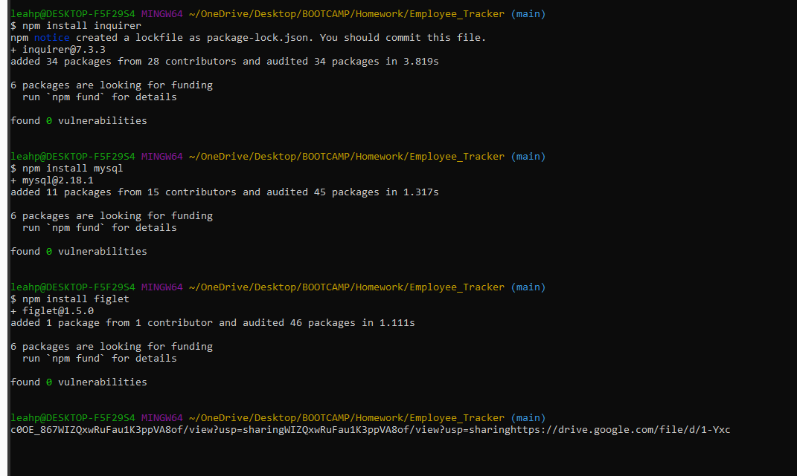

# Employee Tracker

## **Table of Contents** 

  - [Description](#description)
  - [Elements](#elements)
  - [Installation Instructions](#installation)
  - [Demo](#usage)
  - [Contributors](#contributors)
  - [Aids](#aids)
  - [Links](#links)

## **Description**
For this assignment we were asked to create an employee tracker that allows you to add, view, and update Departments, Roles, and Employees to a database. 
## **Elements**
Database:
To create the app the first thing we needed was to create a database in mySQL. The database needed to include 3 tables. One for departments, one for roles, and one for employees.

Javascript:
Once the database was created we next had to connect to the database and build the code that would prompt the questions for the user.

## **Installation Instructions**
You can install express, mysql, and body-parser via the terminal or gitbash

  npm install inquirer
  
  npm install mysql
  
  npm install figlet (for title)

 
## **Test**

## **DEMO**
[Video Link](https://drive.google.com/file/d/1-Yxc0OE_867WIZQxwRuFau1K3ppVA8of/view?usp=sharing)

## **Contributors**
This assignment was done by:

Leah O'Gorman -- https://github.com/leahogorman

## **Aids**
research was done by searching w3schools and stackoverflow

https://www.w3schools.com/

https://stackoverflow.com/

Additionally the project was done with aid from our instructors

Fil -- https://github.com/c0dehot

Daniel Ceballos -- https://github.com/shibeknight

## **Links**
https://github.com/leahogorman/Employee_Tracker

